#### These procedure steps will be followed on the simulator

1. Open the Dissolved Oxygen simulation file, a new window will open as shown below. Hover on "Description" and "Solutions used" label to understand the terminologies and reagents used in the experiment. Click on NEXT button to proceed. 
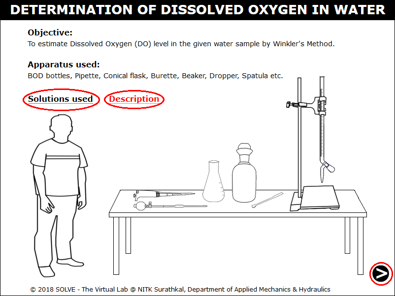 

2. Click on the funnel to take Sodium Thiosulphate in burette. 
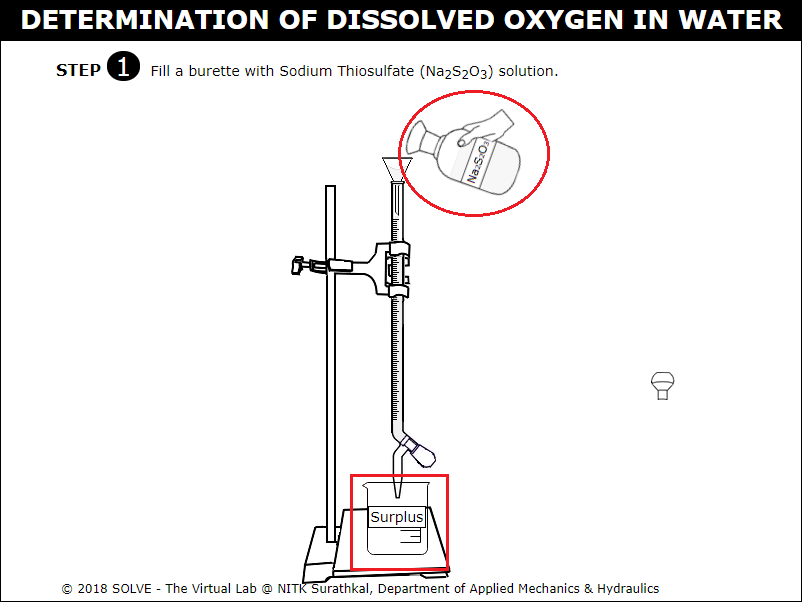 

3. Click on graduated pipette to take 10ml of Potassium Dichromate in a conical flask. 
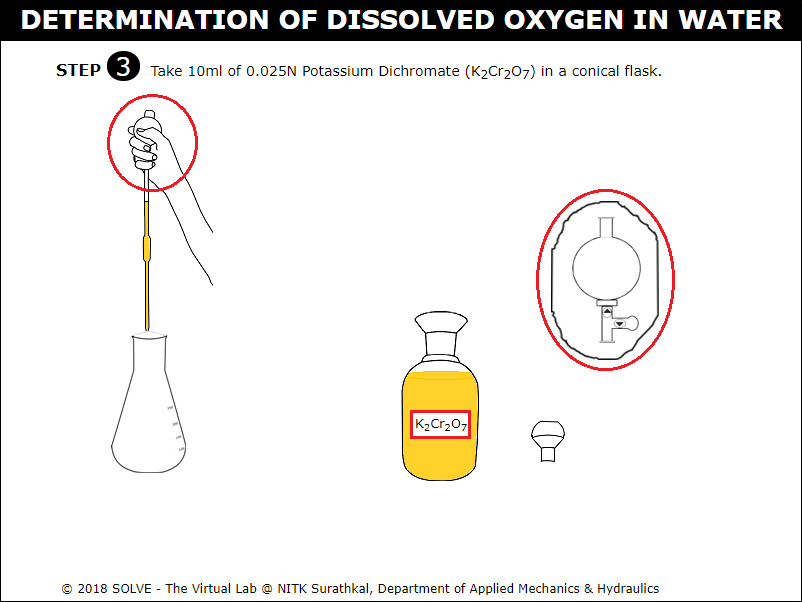 

4. Click on automatic pipette to take 2ml of Hydrochloric Acid in a conical flask. 
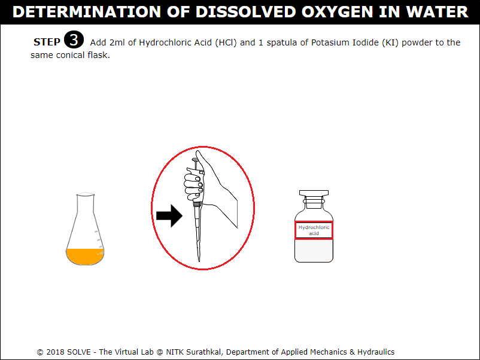 

5. Click on spatula to add 1 spatula of Potassium Iodide powder to the conical flask. 
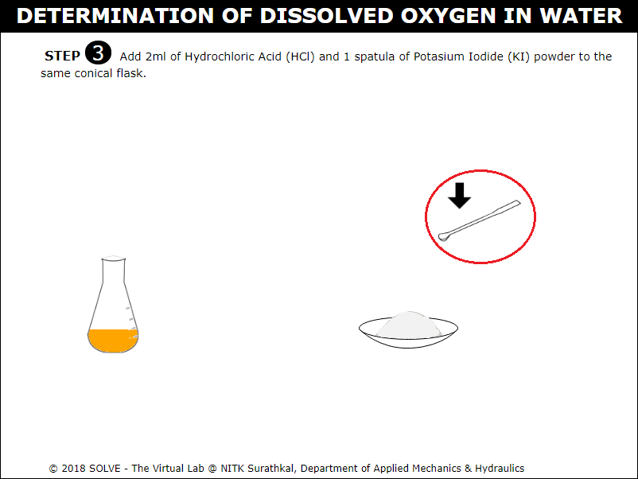 

6. Answer the question by selecting the correct answer, click on NEXT button to proceed to next step. 
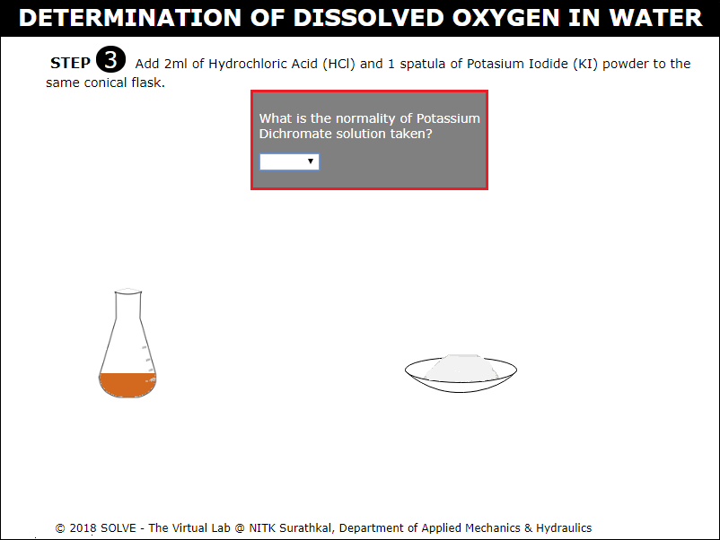 

7. Click on knob to titrate against Sodium Thiosulphate solution (Na2S2O3). 
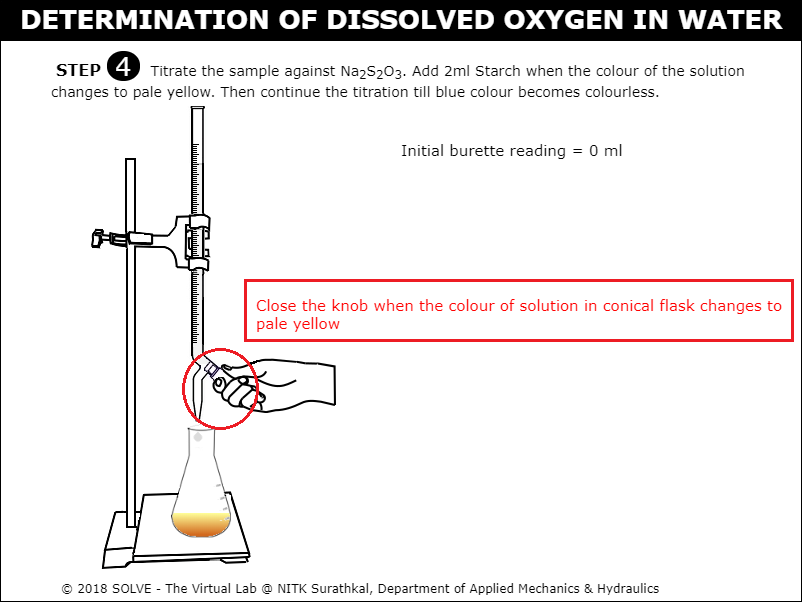 

8. Click on Starch bottle to add 2ml when colour in the conical flask turns pale yellow on adding Starch the solution in conical flask turns blue. 
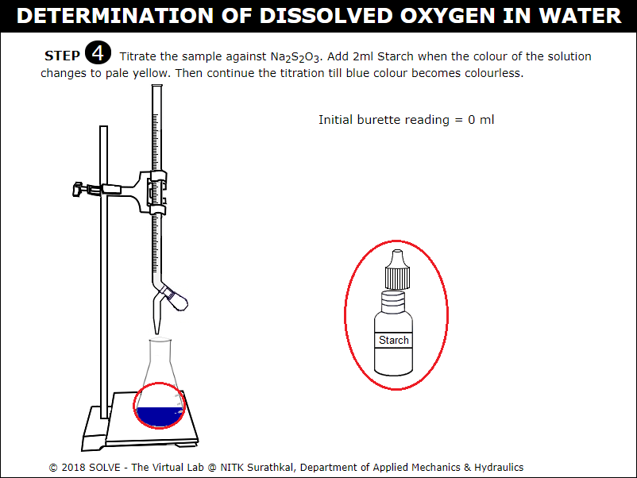 

9. Click on knob to continue titration till the solution in conical flask turns colourless, click on NEXT button to proceed. 
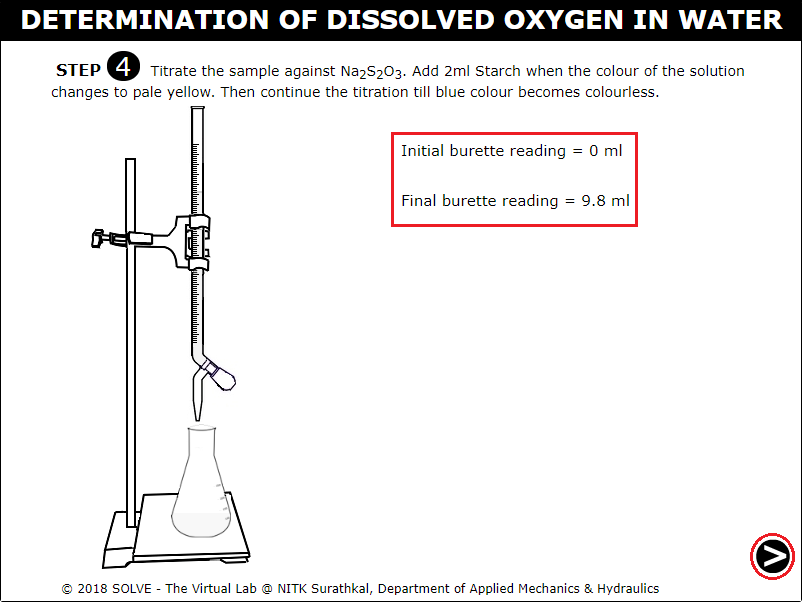 

10. Note down the observation, calculate the Normality value of Sodium Thiosulphate, evaluate the answer by clicking on CHECK button, click on NEXT button to proceed. 
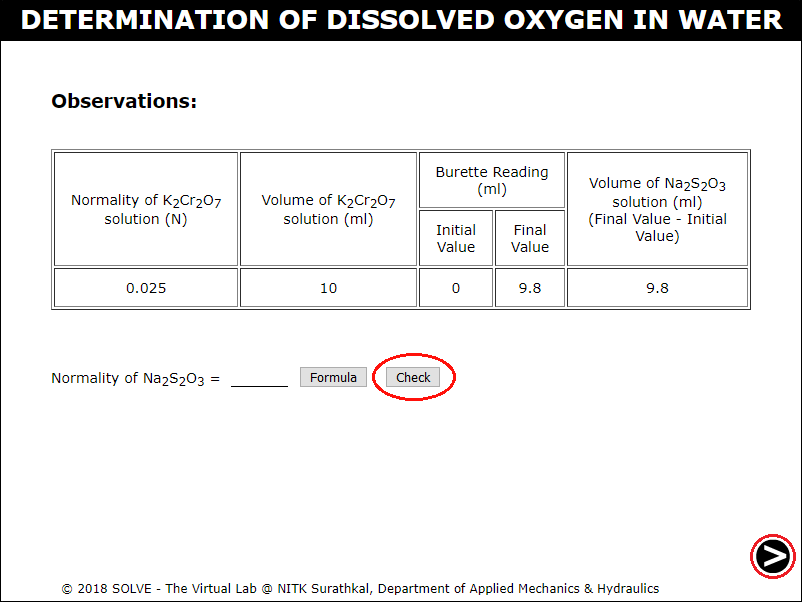 

11. Click on the test sample bottle to fill the sample in BOD bottle. 
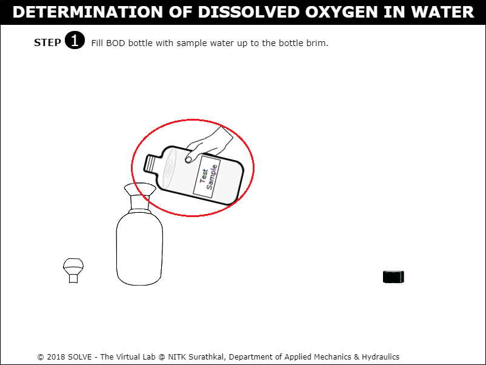 

12. Click on automatic pipette to add 2ml of Manganese Sulphate solution into the BOD bottle. 
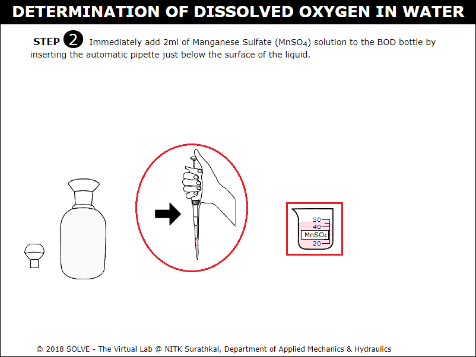 

13. Click on automatic pipette to add 2ml of Alkali-Iodide-Azide reagent into the BOD bottle. 
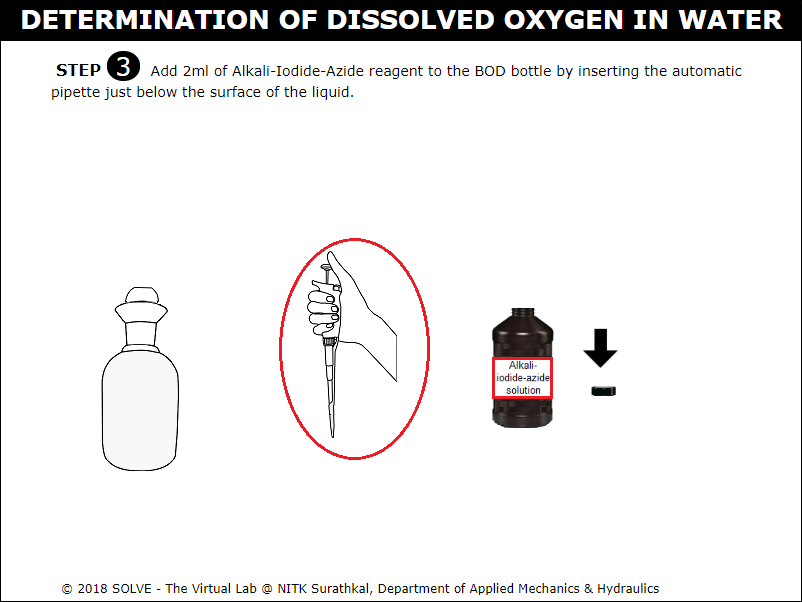 

14. Allow the precipitate to settle down for few minutes. 
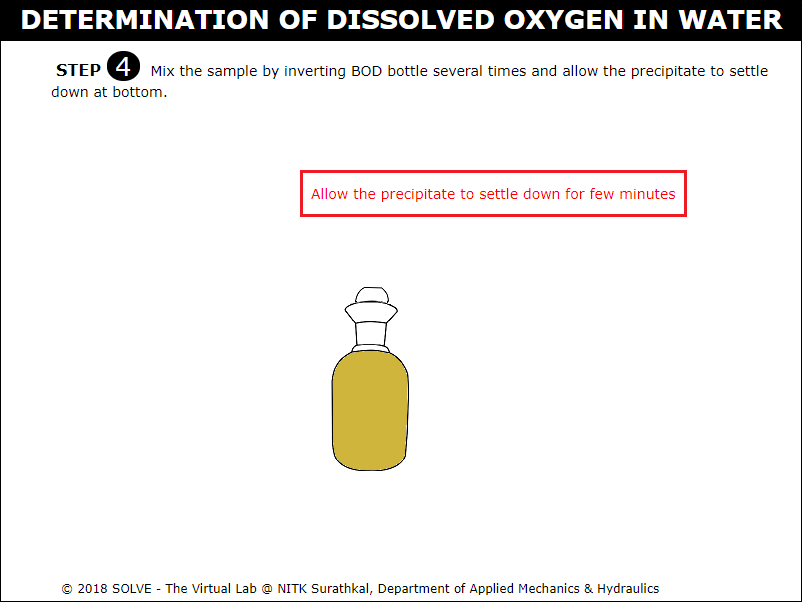 

15. Click on graduated pipette to add 2ml concentrated Sulphuric Acid. 
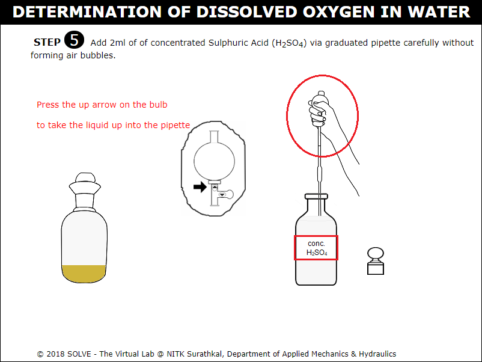 

16. Click on graduated pipette to add 200ml of sample to the conical flask. 
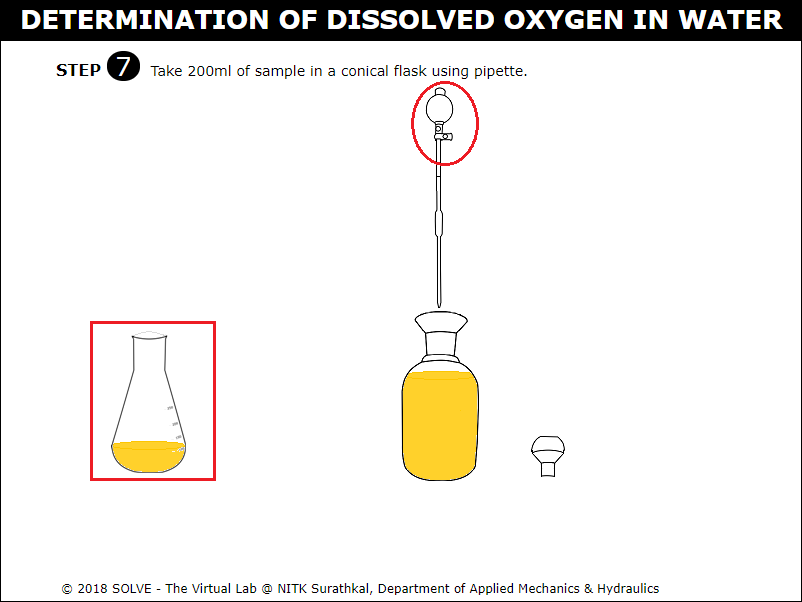 

17. Click on knob to titrate against 0.025N Sodium Thiosulphate (Na2S2O3) solution. 
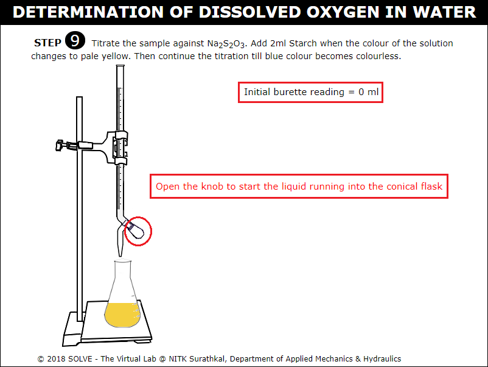 

18. Click on Starch bottle to add 2ml of Starch when the colour of solution in conical flask turns pale yellow upon adding Starch the solution turns Blue, continue titration till the sample colour changes to colourless. 
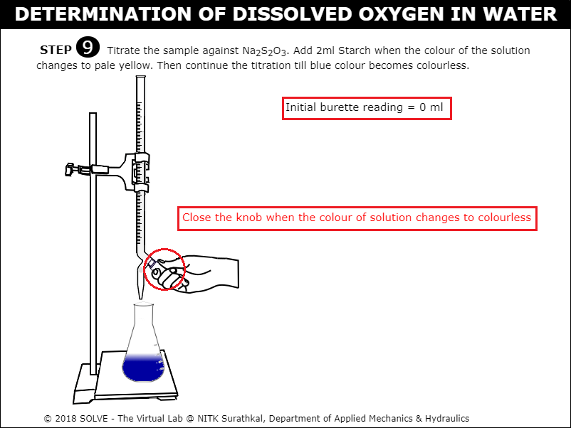 

19. Note down the observation then calculate the value of Dissolved Oxygen for the given sample, evaluate the result by clicking on CHECK button, click on NEXT button to proceed. 
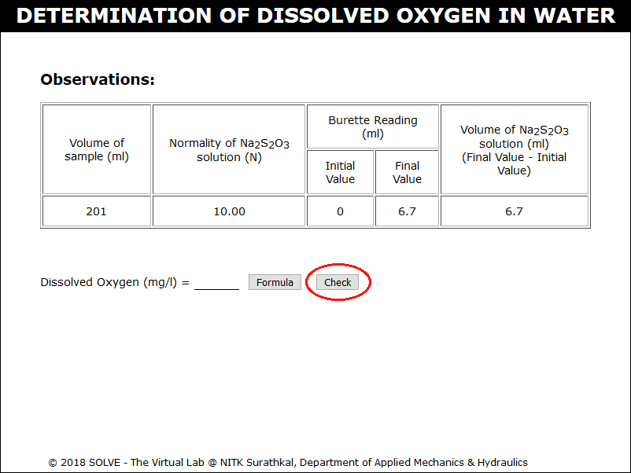 

20. Go through the Inference drawn from the obtained result. 
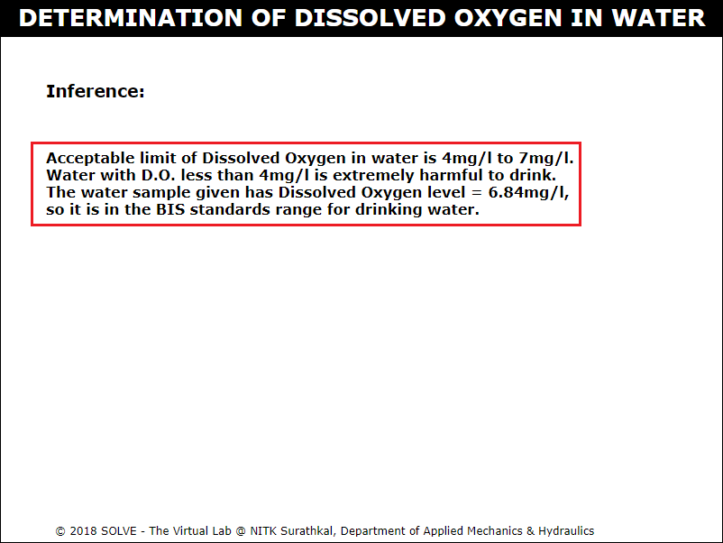 
